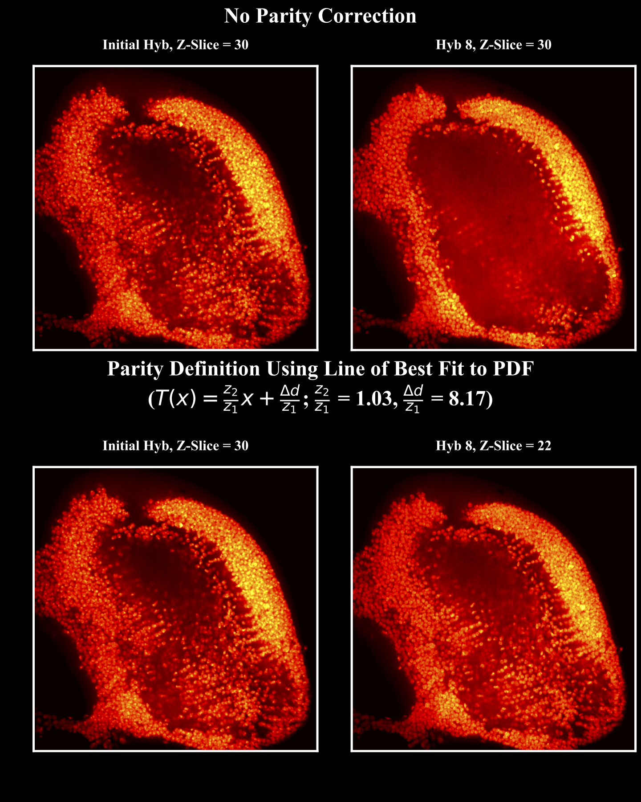

# ImageRegister




## Description

This is the python version of an image registration algorithm written to register two 3D imager stacks within the 


## Test Run ParityCorrect

Place two 3D matrcies within this directory, in the TIF format. Name the files as follows: "first.tif" and "second.tif."

Then, run ParityCorrect:
```
python3 ParityCorrect.py
```


## Author

[@Harshaan Sekhon](https://www.linkedin.com/in/shaan-sekhon-1a217b154/)

## Version History

* 1.0.0: Initial Release

## License

Copyright (C) California Institute of Technology - All Rights Reserved
